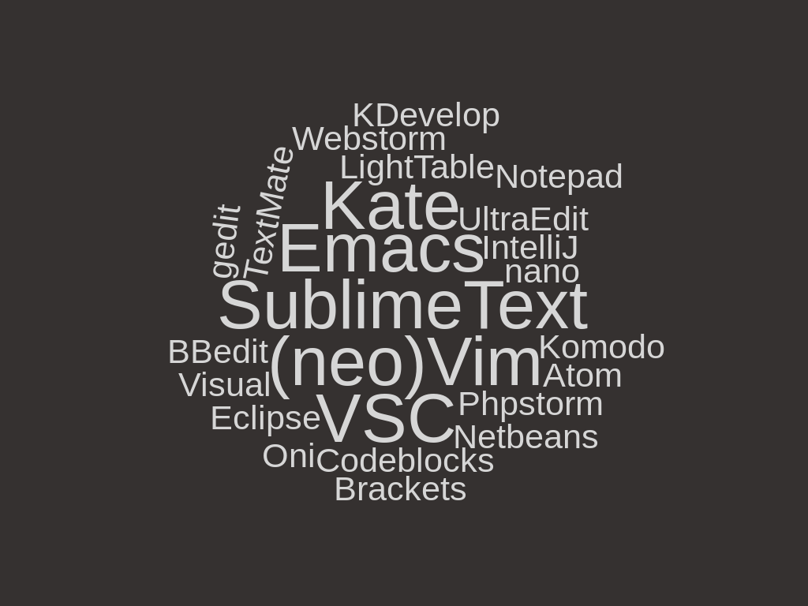

# Intro

- biased by my style of flow
- always adopt to your needs
- not comprehensive

# My Environment

- Manjaro Linux (Arch based)
- KDE Plasma 5 DE
- konsole and zsh

# Lvl 1 Basics

- use TAB
- use your history
- `!!` and `!$`
- use both "clipboards"
- use `man`

# Lvl 2 Shell

- `C-a`, `C-e`
- `C-w` delete word
- `S-PAGEUP/DOWN`
- `C-r` search history
- history auto completion
- `cd` and `cd -`

# Lvl 3 *shrc

- history settings
- aliases
- functions
- zsh-autosuggestions
- zsh-syntax-highlighting

# Lvl 4 Aliases

```sh
alias pacin='trizen -S'
alias gst='git status'
alias ..='cd ..'
alias dl='cd /$HOME/Downloads/'
alias freq='watch grep \"cpu MHz\" /proc/cpuinfo'
alias externalip='echo $(curl -ss http://ipecho.net/plain)'
alias rm='echo "Wrong command"; false'
alias v.="vim ."
alias xo='xdg-open'
```

# Lvl 5 Functions

- lg
- cdgroot
- dexec
- vbx-*

# Lvl 6 dotfiles

- [version control](https://github.com/Allaman/dotfiles)
- [symlink](https://github.com/thoughtbot/rcm)
- [automate it](https://github.com/Allaman/ansible-role-dotfiles)

# Lvl 7 Tools

- selection of tools
- only scratching
- see links section

## ripgrep

## fd

## fzf

## fasd

## broot

## trans

## tig

## trash-cli

## cloc

## VSC

- Remote Extension
- Gitlens
- Draw.io
- Live Share

# Lvl 8 Scripting

- gitconfig-generator.sh
- dockerhub-login.sh

# Lvl 9 System

- `setxkbmap` and [xcape](https://github.com/alols/xcape)
- use virtual desktops
- use Yakuake/Guake
- use a launcher (krunner,...)
- use custom shortcuts

# Lvl 10 Display

- clickless focus
- single vs multiple displays
- windows vs tabs
- structure your apps

# Lvl 11 Editors

{#id .class width=65% height=65%}

# Expert Lvl Modal Editing

- the home row
- "everything Vim"

# Links

[Revealjs](https://knowledge.rootknecht.net/revealjs)

[CLI Applications](https://knowledge.rootknecht.net/cli-applications)

[GUI Applications](https://knowledge.rootknecht.net/gui-applications)

[CLI Web Services](https://knowledge.rootknecht.net/cli-web-services)

[Tmux](https://knowledge.rootknecht.net/tmux)

[FZF](https://knowledge.rootknecht.net/fzf)

[Source of the slides](https://github.com/Allaman/productivity)

# {data-background-image="question-mark.jpg"}
